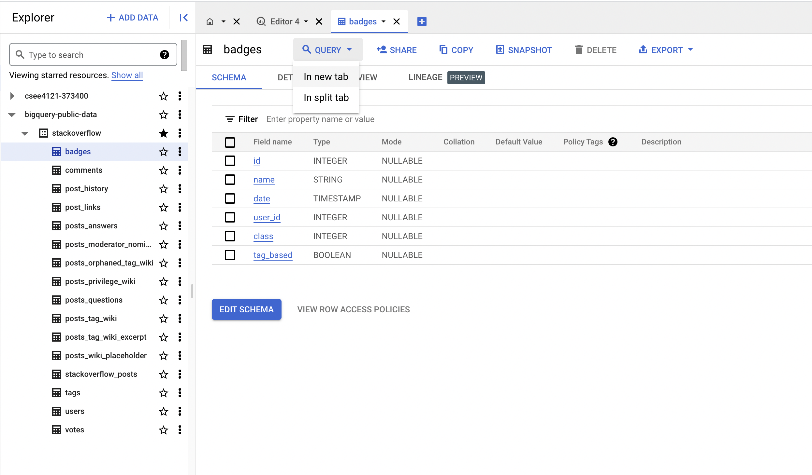
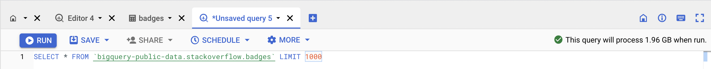

# Programming Homework 1: SQL 

Gain a hands-on understanding of Google BigQuery and SQL.

Due: **February 23, 2023 at 4:59:59 PM**

## Overview

Welcome to CSEE 4121! This assignment will help you get familiar with the Google
BigQuery platform and the SQL language. Google has published many datasets on
BigQuery -- these range from StackOverflow statistics to real-time air quality
data. In this first assignment, you will be using BigQuery’s SQL interface to
answer questions about the StackOverflow Dataset. 

## Learning Outcomes

After completing this programming assignment, students should be able to:

* Write SQL queries on the Google BigQuery platform.
* Use SQL to perform a preliminary analysis of any dataset.

## Getting Started

This section will guide you through creating a BigQuery project and setting up
your account so that you can query the StackOverflow dataset.

1. Make sure you have followed the
   [instructions](http://www.cs.columbia.edu/crf/cloud-cs/) provided by CRF to
   redeem your credits in Google Cloud.

2. Click this
   [link](https://console.cloud.google.com/projectselector2/home/dashboard).
   You’ll see the page below; click “Create Project” to make a GCP (Google Cloud
   Platform) project.
   
   

3. Fill in the information to make a new project. Make sure to select the new
   billing account you set up after redeeming the class GCP credits.

   

   If you mess this up and select the wrong billing account, please follow these
   [instructions](https://cloud.google.com/billing/docs/how-to/modify-project#to_change_the_projects_account_do_the_following)
   to change the billing account for your project to the billing account created
   in Step 1.

4. Go to this
   [link](https://console.cloud.google.com/bigquery?project=bigquery-public-data&page=project),
   which is the page for BigQuery’s public datasets. Make sure to select the
   correct project in the dropdown menu on the top left.

   In the sidebar, you should see a search menu and a menu for
   `bigquery-public-data`. Search for the `stackoverflow` dataset, making sure
   to click "Expand search to all", and star it. This will allow you to quickly
   access it in the future. Make sure to exit the search after doing so.

5. Click on and expand the dataset. You should see 16 tables in the sidebar.
   Click on each table -- you should see the schema and descriptions of each
   table. 

   Although we will only be dealing with a subset of these tables, it is
   recommended to familiarize yourself with these tables before you jump into
   writing queries.
   
   This assignment is intended to test your ability to translate a question in
   plain English to a schema -- in other words, we want you to explore the data
   and think about which tables and columns are necessary in order to answer the
   questions. This is how real world data querying and analysis works!

6. Once you've selected a table, click on the `QUERY` dropdown menu and select
   `In new tab` to start a query on a table.

   

7. Once you type in your query, you should notice that the green validator on
   the top right corner of the editor. This estimates how much data will be
   processed when the query is run.
   
   **Note:** you will be billed by the number of bytes read by each query. Each
   month, only the __first 1TB read is free__, so be careful and try to avoid
   using `SELECT *`.

   

8. In declarative languages, it’s easier to build up the query piece-by-piece.
   Start with a basic outline of what you’re looking for (for example, write a
   broad condition, or do a join). Then, add complexity to your query one bit at
   a time. It’s much easier to debug this way as well.

9. BigQuery can auto-format your SQL queries with <kbd>Ctrl-Shift-F</kbd> on
   Windows or <kbd>Cmd-Shift-F</kbd> on macOS (You may need to do some editing
   for it to take effect). This is a good way to learn about conventional SQL
   style guidelines and will also make your queries more readable, which we
   appreciate.

   __Note__: When querying in BigQuery, table names should be wrapped in
   backticks (`). For example, instead of writing:

   ```sql
   SELECT * FROM bigquery-public-data.stackoverflow.users
   ```

   write:

   ```sql
   SELECT * FROM `bigquery-public-data.stackoverflow.users`
   ```

## Helpful Resources

- [BigQuery SQL syntax](https://cloud.google.com/bigquery/docs/reference/standard-sql/query-syntax)
- [Using Cloud Console](https://cloud.google.com/bigquery/docs/quickstarts/query-public-dataset-console) (First section)

## Questions

**Please read the submission instructions carefully before starting the
assignment.**

Now that you’ve gotten comfortable with BigQuery and its SQL querying interface,
let’s get to work and answer some questions about the StackOverflow dataset!

You will be asked to submit a CSV file containing the results of your queries
for each question. You can download the results of a query using the
`SAVE RESULTS` button in the `Query results` panel and choose to save the CSV
as a local file. We will provide the column names for the expected output.

**Notes:**

-  We will be using an autograder for grading this assignment. Hence, it is
   critical that you follow the ordering and other constraints as mentioned in
   the instructions. There is no partial credit for this assignment.
-  We will only be working with the following tables: `badges`, `posts_answers`,
   `posts_questions` and `users`. You should ignore all other tables that are
   present in the StackOverflow dataset, and use a **subset of the above
   mentioned tables only** to answer the questions below.
-  In general, the problems don't state which table you should look at. Instead,
   it's up to you to figure that out based on the context.
-  **CSV output should match exactly in ordering and in values.** Make sure to
   not modify it after downloading from GCP.

1. (1 point) List the top 10 users with the highest reputation with upvotes
   greater than 20000 and down votes less than 500. Order by highest reputation
   (i.e., in descending order).

   | display_name | reputation | up_votes | down_votes |
   | :----------: | :--------: | :------: | :--------: |
   |              |            |          |            |

2. (1 point) Distribution of users geographically. 

   List the top 10 locations with the most users, in descending order by count.

   | location | count |
   | :------: | :---: |
   |          |       |

   You might have noticed that there are many `null` values in the dataset.
   Additionally, the location information is not consistently formatted. In the
   following questions, we will take address these issues.

3. (2 points) Distribution of users with respect to countries.

   List the top 20 countries with the most users, along with their count. Order
   them in descending order by count.

   Since the location data is messy, we will take the following actions
   for some of the countries. **All strings below are case-sensitive.**
   
   If the location contains:

   -  either "USA" or "United States" as a substring, convert the country name
      to "USA".
   -  either "London" or "United Kingdom" as a substring, convert the country
      name to "UK".
   -  "France" as a substring, convert it to "France".
   -  "India" as a substring, convert it to "India".
   -  "Bangladesh" as a substring, convert it to "Bangladesh".
   -  "Canada" as a substring, convert it to "Canada".
   -  "Pakistan" as a substring, convert it to "Pakistan".
   -  "Germany" as a substring, convert it to "Germany".
   
   **Omit all `null` values** of locations in the results. For any other
   locations, please leave them as-is.

   **NOTE**: Only use `SELECT` statements. No `UPDATE` statements are necessary.
   You should use a series of `CASE ... WHEN` statements. No regexes are necessary.

   | country | num_users |
   | :-----: | :-------: |
   |         |           |

4. (1 point) We now focus on user activity on StackOverflow. List the number of
   active users every year (since StackOverflow was founded).

   Order by years in ascending order.

   We consider active users with respect to a year to be users whose
   `last_access_date` was in that year. It does not matter whether the user was
   online in previous years or not. For example, if a user's `last_access_date`
   was in the year 2020, then the user will **only be considered an active user
   for 2020.** 

   | last_access_year | num_users  |
   | :--------------: | :--------: |
   |                  |            |

5. (2 points) Some users are dormant, while some are active. We would like to
	find examples of dormant users. Assume today is **January 7, 2023**. List the
	users (`id`, `display_name`, `last_access_date`) along with
	`days_since_last_access` and `days_since_creation`, which are defined below: 
    
   -  `days_since_last_access`: the number of days between the user’s last
      access and Jan 7, 2023.
   -  `days_since_creation`: number of days between their account creation and
      their last access.
   
   List the top 10 users with the above requirements, in order of
   `days_since_last_access` (descending order), `days_since_creation`
   (descending order), and `id` (ascending order). 
   
   **NOTE**: Having multiple ordering criteria serves as a tiebreaker mechanism,
   leading to deterministic output. The ordering criteria are listed in order of
   priority. That is, results should first be ordered by
   `days_since_last_access`, then `days_since_creation`, and finally by `id`.
   **Make sure to follow this ordering priority!**

   **HINT**: The `DATE_DIFF()` function allows you to compare two dates and
   extract components from the difference. You may need to cast the given
   fields, since they are of type `TIMESTAMP`.

   | id | display_name | last_access_date | days_since_last_access | days_since_creation |
   | :-:| :----------: | :--------------: | :--------------------: | :-----------------: |
   |    |              |                  |                        |                     |

6. (2 points) How does a user's reputation change with upvotes and downvotes?
	Since users' reputations vary widely, we will bucketize the users into the
   following reputation buckets: 0-100, 101-1000, 1001-10000, 10001-100000,
   and >100000.

   These are reputation values converted to intervals. Ensure that the above
   intervals are strings in your final output for the `reputation_bucket`
   column.

	For every reputation bucket, do the following:

   -  calculate the upvote ratio (round it to **two decimal places**) as
      `upvote_ratio` = (total upvotes) / (total downvotes). This is the ratio of
      the sum of upvotes to the sum of downvotes for the users in that bucket.
   -  calculate the number of users that lie in the bucket as `num_users.

   Order by `num_users` in descending order.

   **NOTE**: Use the exact reputation bucket values mentioned above. Do not
   change the interval values. 

	**HINT**: Use `CASE… WHEN` operators for bucketizing, and the `ROUND`
	function for rounding the ratio to the appropriate number of decimal places.

   | reputation_bucket | upvote_ratio | num_users |
   | :---------------: | :----------: | :-------: |
   |                   |              |           |

7. (2 points) What were the most popular tags in the year 2021 on StackOverflow
   based on their occurrence? List the top 10 tags along with their count.

   Order by `count` (descending), and then by `tag` (ascending).

	**Clarification**: You could get the distribution of tags with their counts
	from the tags table. However, it would be difficult to obtain the count
	specifically for the year 2021. We suggest using the tags attribute in the
	`posts_questions` table instead.

   **Note**: The year corresponds to the year when the questions were created.

	**HINT**: the `SPLIT` function allows you to split a string based on a
	delimiter. `UNNEST` function returns a table based on an array as input.

   | tag | count |
   | :-: | :---: |
   |     |       |

   You should see that *python* and *javascript* were the most popular tags in
   2021.

8. (1 point) **Badge Analysis**: StackOverflow rewards users with various kinds
	of achievement badges based on different milestones. The badges are divided
	into three classes: Gold (1), Silver(2) and Bronze(3). More about them
	[here](https://stackoverflow.blog/2021/04/12/stack-overflow-badges-explained/).
    
   Each category of badges has several different badges listed in it.

   We would like to find out the gold badges that StackOverflow awards most
   frequently.

   List the *top 10 gold badges* by name, along with the number of users who
   have received these badges. Order by the number of users (descending), and
   then by the name (ascending).

   **Note:** A user can receive more than one gold badge of the same name. We
   will not do any special handling for this case. That is, if a user has
   recieved a badge twice, we count that user twice.

   | name | num_users |
   | :---:| :-------: |
   |      |           |

9. (2 points) What is the relationship between a user's reputation and badges
   earned?

	List the top 10 users along with the number of gold badges they have earned.

	Order by the number of gold badges (descending), and then by `id` (ascending).

   | id | display_name | reputation | up_votes | down_votes | num_gold_badges |
   | :-:| :-----------:| :---------:| :------: | :---------:| :-------------: |
   |    |              |            |          |            |                 |

10. (2 points) **“Illuminator”** is the rarest badge that is awarded by
    StackOverflow. So far, only 164 users have been awarded this badge. 

    We would like to find out how early you can obtain this badge. List the top
    20 users (`id`, `display_name`, `reputation`) along with the number of days
    it took them to receive their first Illuminator badge (since they
    created their account).

    Order by the number of days (ascending), and then by `id` (ascending).

    | id | display_name | reputation | num_days |
    | :-:| :----------: | :--------: | :------: |
    |    |              |            |          |

11. (1 point) Previously, we compared `upvote_ratio`s between reputation
    buckets. In this question, we investigate a similar relationship between the
    score and view counts for questions asked on StackOverflow.

	 Use these score buckets: <0, 0-100, 101-1000, 1001-10000, >10000.

	 List the average number of views for each score bucket. Round it to 2
    decimal places and order it by `avg_num_views` in ascending order. 

    **HINT**: Use the *ROUND* function provided by BigQuery.

    | score_bucket | avg_num_views |
    | :----------: | :-----------: |
    |              |               |

    We can see the high correlation between the scores and the ranges. This
    seems pretty natural, but it is important to confirm some of our assumptions
    before conducting further analysis.

12. (1 point) Which weekday had the most answers submitted? 

    List the day (using numbers 1-7) along with the total number of answers
    given that day.
    
    Order by the number of answers (descending), and then by `day_num`
    (ascending).

	 **HINT**: The `DAYOFWEEK` function allows you to extract the weekday. Its
	 range is 1-7 with 1 corresponding to Sunday. The values of the `day_num`
    column should be numerical.
    
    | day_num | num_answers |
    | :-----: | :---------: |
    |         |             |

    Interestingly, *Wednesday* has the most answers! It’s not surprising that
    users do not answer much during weekends.

13. (1 point) What is the percentage of questions that are answered every year?

	 List the year, number of questions in that year, and the percentage of all
	 questions answered (multiply the fraction by 100 and then round it to 2
	 decimal places).

    A question is said to be answered if the `answer_count` field is greater
    than zero.

	 Order by the year in ascending order.

    **Clarification**: A question only belongs to the year in which it was
    created. For example, if a question had a creation year of 2020, then it
    belongs exclusively to 2020.

    **HINT**: Use the `ROUND` function available in BigQuery.

    | year | num_questions | percentage_answered |
    | :--: | :-----------: | :-----------------: |
    |      |               |                     |

14. (2 points) List the top 20 users with the most answers along with their
    `id`, `display_name`, `reputation`, and the number of answers. 

    Print only users with a number of answers greater than 50. Order them by the
    number of answers (descending), and by `id` (ascending).

    **Clarifications**:

    - The `answer_count` and `accepted_answer_id` fields are all `null` for
      `posts_answers`.
    - `id` refers to the id of the answer text. `owner_user_id` refers to the
      user who answered. `parent_id` refers to the id of the question
      corresponding to the answer.

    | id | display_name | reputation | num_answers |
    | :-:| :----------: | :--------: | :---------: |
    |    |              |            |             |

15. (2 points) We would now like to find users specializing in Python. A user is
    considered a Python specialist if they have answered a large number of
    Python-based questions on StackOverflow.

    A Python-based question is a question which contains the substring
    `"python"` as one of its tags.
    
    With all the conditions remaining the same from the previous question, print
    the top 20 Python specialists along with the number of answers they've
    submitted to Python-based questions.

    **Note:** Every answer in `posts_answers` has a `parent_id` attribute
    pointing to the `question_id` (in `posts_questions`). Multiple answers can
    have the same `parent_id`.

    | id | display_name | reputation | num_answers |
    | :-:| :----------: | :--------: | :---------: |
    |    |              |            |             |

16. (2 points) Analyzing posts with extreme scores.

    List the average number of answers, favorite count, and comment count for
    posts with `score < 0` and `score > 10000`.

    There should be two rows in the table, with each row corresponding to one of
    the two score categories.

    Round up to 2 decimal places, and order by score.

    | score | avg_answers | avg_fav_count | avg_comments |
    | :---: | :---------: | :-----------: | :----------: |
    | <0    |             |               |              |
    | >10000|             |               |              |

    **Note:** Ensure that the output csv has two rows with the score column
    matching the values in the sample table **EXACTLY** (string with no spaces).

This is the end of the assignment - great job!

## Submission Instructions

This is a __solo__ project. Every student should submit their own work.

### File Submission

Each student should submit one zip file to Gradescope.

1. Copy all your queries into `hw1_submission.py`. You can find the file
   on Courseworks. In order to be properly graded, the **file must be named
   `hw1_submission.py`**.

2. Rename your CSV outputs to `qN.csv`, where `N` is the question number. For
   example, question 10 would be `q10.csv`.

3. Please ensure that your directory structure is as shown below. The zip file
   that you submit should have all the csv results as well as
   `hw1_submission.py` **at the root**. 

   If these files are present in any other folder inside the zip file, then the
   autograder will fail, yielding no points. 

Zip file structure:

```
UNI_assignment1.zip
├── hw1_submission.py
├── q1.csv
├── q2.csv
├── q3.csv
├── q4.csv
├── q5.csv
├── q6.csv
├── q7.csv
├── q8.csv
├── q9.csv
├── q10.csv
├── q11.csv
├── q12.csv
├── q13.csv
├── q14.csv
├── q15.csv
└── q16.csv
```

### Notes:

When you submit to Gradescope, we will automatically check the following:

-  Your SQL query syntax.
-  The file structure of your submission (whether all the files follow the
   naming convention).
-  That all files are present.
 
This should run immediately and return whether the query ran OK or if there were
errors - please make sure that you get a positive result from this test in your
final submission.

**Handling Ties**: You may have noticed that in case of ties (between two
records of the ordering column), BigQuery may produce either of the orderings.
Make sure to follow the tiebreaker criteria specified in each part. You will
recieve no credit for incorrect output due to mishandled ties.

You will not see a final grade until after the project deadline. It is your
responsibility to ensure that your final submission is free of Python or SQL
syntax errors and that you follow all instructions in this section. We reserve
the right to deduct points from your project if you do not follow the submission
instructions, or if you have syntax errors in your queries.

The autograder automatically checks for cheating. Students that are caught
cheating will receive a 0.
