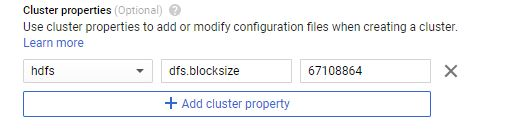
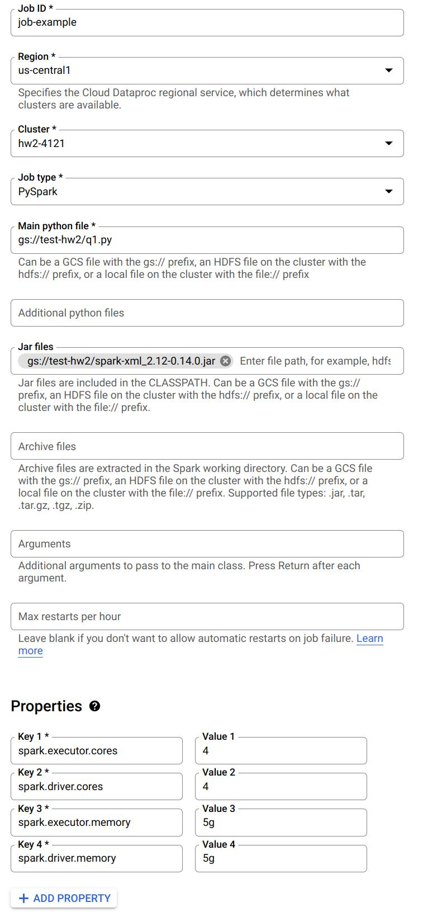

# Programming Homework 2: A Tour of Apache Spark

Gain a hands-on understanding of Google Cloud Dataproc, Apache Spark, Spark SQL, and Spark Streaming over HDFS.

Due: **April 25, 2024 4:59:59 PM**   

## Overview

First introduced in [2010](https://www.usenix.org/legacy/event/hotcloud10/tech/full_papers/Zaharia.pdf), Apache Spark is one of the most popular modern cluster computing frameworks.

By leveraging its innovative distributed memory abstraction -- Resilient Distributed Datasets (RDDs) -- Apache Spark provides an effective solution to the I/O inefficiency of MapReduce, while retaining its scalability and fault tolerance.

In this assignment, you are going to deploy Spark and HDFS, write a Spark program generating a web graph from the entire Wikipedia, and write a PageRank program to analyze the web graph.

You will run those applications using Spark over HDFS in Google Cloud Dataproc.

Finally, you will write a stream emitter using Spark Streaming and a parser using Spark Structured Streaming to play with the recent trend of working with streaming data.

As a well-maintained open-source framework, Apache Spark has well-written official documentation; you will find a lot of useful information by simply reading the official tutorials and documents.

When you encounter an issue regarding cluster deployment or writing Spark programs, you are encouraged to utilize online resources before posting questions on Ed.

## Collaboration Policy & Submission Details

You may work on work on this assignment individually, or in a group of 2. However, it is highly recommended that both members set up and run the code for this assignment. 1 submission is required for each group. Please follow the submission instructions provided at the end of this document carefully. There will be seperate submissions for the written questions and the code.

## Learning Outcomes

After completing this programming assignment, you should be able to:

* Deploy and configure Apache Spark, HDFS in Google Cloud Dataproc.
* Write Spark applications using Python with Jupyter Notebook and launch them in the cluster.
* Describe how Apache Spark, Spark SQL, Spark Streaming, and HDFS work and interact with each other.

## Environment Setup

You will complete your assignment in Google Cloud Dataproc, which is a managed cloud service for Spark and Hadoop, which allows users to spin up Spark and Hadoop instances quickly.

First, make sure you have followed the [instructions](http://www.cs.columbia.edu/crf/cloud-cs/) provided by CRF to redeem your credits in Google Cloud.

Then, use the following [link](https://console.cloud.google.com/dataproc), and click on `Enable API` to enable Google Cloud Dataproc. __Note__: you could pin Dataproc on your navigation menu for quick access.

Click on `Create cluster` to create your first Dataproc Cluster (Note: create the cluster on Compute Engine when prompted). Notice there are three Cluster modes you could choose from: Single Node, Standard, and High Availability. We will start with a Single Node cluster.


#### Jupyter Notebook

You will use Python and Jupyter Notebook for this project. If you are unfamiliar with Jupyter Notebook, [this](https://towardsdatascience.com/jypyter-notebook-shortcuts-bf0101a98330) tutorial might be helpful.

Google provides an easy interface to install and access Jupyter notebook when creating a Dataproc cluster. Go down to __Component gateway__ and select __Enable access to the web interfaces of default and selected optional components on the cluster__. Then click on `Advanced options`.


Go down to __Optional components__ and click on `Select component`. In the pop-up window, choose Anaconda and Jupyter Notebook (If you are using 2.0 Image Type such as 2.0-debian10, you don't need to choose Anaconda, it is pre-installed with miniconda, see [this](https://cloud.google.com/dataproc/docs/concepts/versioning/dataproc-release-2.0)). Make sure you click on `Select` to save your changes.


You could refer to [this](https://cloud.google.com/dataproc/docs/tutorials/jupyter-notebook) doc for more details. 

#### Cluster properties
Components like Spark and Hadoop have many configurations that users could tune. You could change the default values of those settings when creating the Dataproc cluster. Refer to [this](https://cloud.google.com/dataproc/docs/concepts/configuring-clusters/cluster-properties?hl=en_US&_ga=2.227749979.-739108073.1578339387) doc for a more detailed explanation. 
For example, if you want to change the default block size of HDFS to 64MB, you could change it by adding a cluster property under __Cluster properties__ in the Advanced Options section. You will need to edit the cluster properties to complete this homework, but you can leave it alone to get started.


#### Attatching a Cloud Storage Bucket:
Since you will be working with Jupyter Notebooks on a dataproc cluster, it becomes important to save your notebook periodically. This is needed to protect your work in case your cluster goes down for some reason. Thankfully, if you attach a cloud storage bucket with your dataproc cluster, Dataproc will automatically save the notebook on the linked bucket. Thus, you can always fetch your notebook from the bucket itself.

#### Steps:

- Create a cloud storage bucket with default configurations and any suitable name as per your preference. Follow [this](https://cloud.google.com/storage/docs/creating-buckets) for more details on how to create a bucket on GCP.
- While creating a dataproc cluster, go to `Customize Cluster` and `Cloud Storage staging bucket`. Click `Browse` to select the bucket that you created in the previous step.
    
    
__NOTE__: This step is technically optional but highly recommended. This is to prevent unforseen scenarios wherein you might lose all your progress because of a cluster failure.

## Assignment Overview: Spark and Spark SQL

In this assignment, you will perform 3 tasks:

* Get yourself familiarized with the interface and ingesting a Wikipedia database into HDFS 
* Parse the Wikipedia database to generate a webgraph of the internal links
* Use the generated graph as an input to a Spark PageRank program to generate the ranks of the internal links.

## Task 1: Getting Started (10 Points)

Once you have created the cluster, you have full control over the VM and can download any package you may need. Click on the cluster name to go to the __Cluster details__ page. Go to the __VM Instances__ tab and click on __SSH__, run the following command to download all files to local HDFS. The files might take a while to transfer. In the meantime, [here](https://data-flair.training/blogs/top-hadoop-hdfs-commands-tutorial/) is a tutorial for HDFS commands which might be helpful.

```bash
hdfs dfs -cp gs://csee4121-s23/wiki-small.xml /
hdfs dfs -cp gs://csee4121-s23/wiki-test.xml /
hdfs dfs -cp gs://csee4121-s23/wiki-whole.xml /
```

You can also check your hdfs file through

```bash
hdfs dfs -ls /
```

Also, you would need an external package in order to parse XML files. You need to download [spark-xml](https://libraries.io/maven/com.databricks:spark-xml_2.12) with version `2.12-0.14.0` to support Spark 3.1.2 and Scala 2.12 in  the default 2.0-debian10 image type when you create your cluster. You might need to run it on __all__ of your VMs if you have multiple machines in your cluster.

You can also download it to your local VM instance by the following command:

```bash
sudo hdfs dfs -get gs://csee4121-s23/spark-xml_2.12-0.16.0.jar /usr/lib/spark/jars/
```

Now you can go to the __Web Interfaces__ tab and use the `Jupyter` link to open Jupyter Notebook Interface.
(<b>Note:</b> If the `Jupyter` link doesn't work, try changing the url from https to http).

In this task, we provide you a big Wikipedia database in XML format. It can be found at `/wiki-whole.xml` in your HDFS.

This input file is very big (~30 GB) and you have to use a distributed file system like HDFS to handle it. We have also provided a smaller file `/wiki-small.xml` for debugging purposes. 

The XML files are structured as follow:

```xml
<mediawiki>
    <siteinfo>
        ...
    </siteinfo>
    <page>
        <title>Title A</title>
        <revision>
            <text>Some text</text>
        </revision>
    </page>
    <page>
        ...
    </page>
    ...
</mediawiki>
```

To get a sense of how a Wiki page transfers to an XML file, take a look at the following examples:

* [Apple (orig)](https://en.wikipedia.org/wiki/Apple)
* [Apple (xml)](https://en.wikipedia.org/wiki/Special:Export/Apple)


### Submit a job
Once you are done with the debugging process on the Jupyter Notebook you can download it as a Python (.py) file and submit it as a job to run on the cluster.  Here is a way to submit a job through google cloud console:


The following is an example job:



Notice you can specify a Python file to run from the Google Cloud Storage. Also, when you need to read the XML files, make sure you have included the .jar file. Furthermore, you can specify the number of cores and memory for driver and executor here. 

You could refer to [this](https://cloud.google.com/dataproc/docs/guides/submit-job) doc to learn more about submitting a job. You can also submit a job in other ways.

**Question 1.** (4 points) What is the default block size on HDFS? What is the default replication factor of HDFS on Dataproc?

#### Task 1 Output

Write a Spark program to read in the `/wiki-small.xml` file as a Dataframe and use the `printSchema()` function to print its schema. You can start from something like the following:

```python
from pyspark.sql import SparkSession
spark = SparkSession.builder.getOrCreate()
df = spark.read.format('xml').options(rowTag='page').load('hdfs:/wiki-small.xml')
```

Copy the outputted schema to a __separate txt file__ named `schema.txt`. (6 points)

If you are having trouble debugging your code using Jupyter, you can consider adding the following environment variable at the top of your notebook.

```python
import os
os.environ['PYSPARK_SUBMIT_ARGS'] = '--packages com.databricks:spark-xml_2.12:0.14.0 pyspark-shell'
```

Note that the notebook type should be PySpark, not Python 3.

### Best Practices ###

* Delete the cluster after you are done for a coding session. Do not leave it on overnight. Otherwise, you will burn through your credits very quickly.
* Start with small files and use a one node setup to debug your code. Then try to run your code on bigger files and three-node setup.
* It is recommended to use Jupyter Notebook to debug your code. Make sure you have shutdown all of your Jupyter notebooks before you submit your job using the web interface.

### Task 2: Webgraph on Internal Links (50 Points)

You are going to write a Spark program which takes the XML file you ingested as input, and generate a CSV file which describes the webgraph of the internal links in Wikipedia. The CSV file should look like the following:

```csv
article1	article0
article1	article2
article1	article3
article2	article3
article2	article0
...
```

It is hard and tedious to find every internal link on a page. We have made the following assumptions to simplify the string parsing for you. For each page element, the article on the left column corresponds to the string between `<title>` and `</title>`, while the article on the right column are those surrounded by a pair of double brackets `[[ ]]` in the `<text>` field in the XML file with the following requirements:

1. All the letters should be converted to lower case.
2. If the internal link contains a `:`, you should ignore the entire link unless it starts with `Category:`.
3. Ignore links that contain a `#`.
4. If multiple links appear in the brackets, take the first one; e.g., take `A` in `[[A|B]]`.

Those assumptions help you filter out some unnecessary links. Note if the remaining string becomes empty after the filtering, you should also ignore it. When we say ignoring a link, we mean it will not show up in the output file of this task.

The two columns in the output file should be separated by a `Tab`. You may assume there are no other `Tab`s in the article name.

__Hint__: It is recommended to use UDF + regular expression to extract links from the documents. Also, try to use the built-in Spark functions to sort your results.

**You should use the default configuration of Spark and HDFS, unless we specify a different one.** 

Set the **Spark driver memory** to 1GB and the **Spark executor memory** to 5GB to answer Question 2-4.

For the following questions you will need to use the .xmls as the input file, and output columns into a CSV file. Separate the columns with a `Tab`.

**Question 2.**  (2 points) Use `wiki-test.xml` as input and run the program locally on a __Single Node__ cluster using 4 cores. Include your screenshot of the dataproc job. What is the completion time of the task?

**Question 3.** (2 points) Use `wiki-test.xml` as input and run the program under HDFS inside a __3 node cluster__ (2 worker nodes).  Include your screenshot of the dataproc job. Is the performance getting better or worse in terms of completion time? Briefly explain.

**Question 4.** (2 points) For this question, change the default block size in HDFS to be __64MB__ and repeat Question 3. Include your screenshot of the dataproc job. Record the run time. Is the performance getting better or worse in terms of completion time? Briefly explain.

Set the **Spark driver memory** to 5GB and the **Spark executor memory** to 5GB to answer Question 5-7. Use this configuration across the entire assignment whenever you generate a web graph from `wiki-whole.xml`.

**Question 5.** (2 points) Use `wiki-whole.xml` as input and run the program under HDFS inside the Spark cluster you deployed. Record the completion time. Now, kill one of the worker nodes immediately. You could kill one of the worker nodes by going to the __VM Instances__ tab on the Cluster details page and clicking on the name of one of the workers. Then click the STOP button. Record the completion time. Does the job still finish? Do you observe any difference in the completion time? Briefly explain your observations. Include your screenshot of the dataproc jobs.


**Question 6.** (2 points) Only for this question, change the __replication factor__ of `wiki-whole.xml` to 1 and repeat Question 5 without killing one of the worker nodes.  Include your screenshot of the dataproc job. Do you observe any difference in the completion time? Briefly explain.

**Question 7.** (2 points) Only for this question, change the __default block size__ in HDFS to be __64MB__ and repeat Question 5 without killing one of the worker nodes. Record the run time. Include your screenshot of the dataproc job. Is the performance getting better or worse in terms of completion time? Briefly explain.

#### Task 2 Output

Besides answering these questions,  you also need to submit the code and output. You need to use `wiki-small.xml` as the input file, and sort both output columns in ascending order and save the first 10 rows into a CSV file and name it `task2.csv`. Separate the columns with a `Tab`. Do NOT save the column names / headers as part of the CSV file (this is the default option, but please double check). (28 points for code + output, 10 points for correctness of the approach)


### Task 3: Spark PageRank (40 Points)

In this task, you are going to implement the PageRank algorithm, which Google uses to rank websites in Google Search. We will use it to calculate the rank of the articles in Wikipedia. The algorithm can be summarized as follows:

1. Each article has an initial rank of 1.
2. On each iteration, the contribution of an article A to its neighbor B is calculated as `its rank / # of neighbors`.
3. Update the rank of the article B to be `0.15 + 0.85 * contribution`
4. Go to the next iteration.

The output should be a CSV file containing two columns:
The first column is the article and the other column describes its rank.
Separate the columns with a `Tab`.

Set the Spark driver memory to 5GB and the Spark executor memory to 5GB whenever you run your PageRank program. Write a script to first run Task 2, and then run Task 3 using the CSV output generated by Task 2, and answer the following questions. Always use 10 iterations for the PageRank program. When running Task 2, use `wiki-whole.xml` as input.

**Question 8.** (2 points)  Use your output from Task 2 with `wiki-whole.xml` as input, run Task 3 using a 3 node cluster (2 worker nodes). Include your screenshot of the dataproc job. What is the completion time of the task?

#### Task 3 Output

To submit the code part of the assignment you will need to use `wiki-small.xml` as the input file for Task 2 and then run your code for Task 3. Sort the output by the PageRank in DESCENDING order, i.e., the output should contain the title and PageRank of the articles with the top 10 scores. Save the first 10 rows as a .csv file, separating the columns with a Tab (i.e., sep='\t'). Name it task3.csv. Do NOT save the column names / headers as part of the CSV file (this is the default option, but please double check). (28 points for code + output, 10 points for correctness of the approach)

## Submission Instructions

Only one team member need to make a submission on Gradescope, but make sure both team members are assigned to the submission.

There will be 2 Gradescope submissions required for this assignment.

### 1. Written questions 1-8

This will be a gradescope form. You will input your answers to the written questions 1-8.
Please keep your answers to the written questions succinct. We may deduct points for excessively verbose answers.

### 2. Code and Outputs (zip file)

Name the file `<UNI-1>_<UNI-2>.zip`.

The Spark projects from Task 2-3 should go under folder names `task2`, `task3`, accordingly.

Inside each folder, in addition to the Jupyter notebook and Python files, there should be an additional file named `config` which describes configurations or additional steps you did to run the three tasks mentioned below.

You also need to provide a `config` file which describes configurations or additional step you did to run the **following 3 tasks on a single Spark node **

1. Use the program in Task 2 to take "*wiki-small.xml*" as input to generate the graph.
2. Use the program in Task 3 to take the graph you just generated and output a rank list of the articles in the dataset.

Try to be clear about the instructions to run these steps. The purpose of doing this is to check if your program does what we mentioned in the spec. Do not worry whether your program has the lowest completion time.

In addition to the code, you will need to submit the following output files for each of the tasks:
1. `schema.txt`
2. task2.csv (first 10 rows of the webgraph)
3. task3.csv (first 10 rows of PageRank output)

Zip file structure:
```
UNI-1_UNI-2_assignment2.zip
├── task1
│   └── schema.txt
├── task2
│   ├── task2.csv
│   ├── task2.py
│   ├── task2.ipynb
│   └── task2config.txt
└── task3
    ├── task3.csv
    ├── task3.py
    ├── task3.ipynb
    └── task3config.txt
```

## Acknowledgements

This assignment is based on Peifeng Yu and Mosharaf Chowdhury's UMICH EECS598: Advanced Topics on Systems for X.
